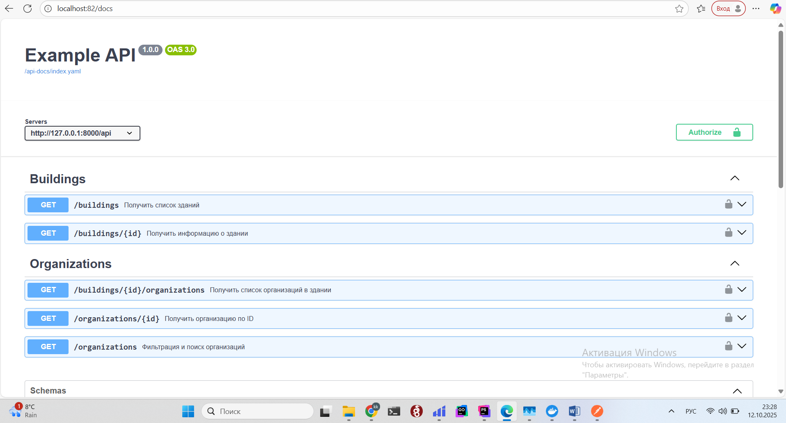
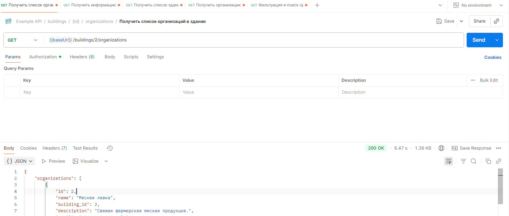

Тестовое задание с использование спцеификации OpenAPI:

# чтобы запустить проект нужно:

# 1) Поднять контейнеры:
docker compose -f .\docker-compose.yml up --build
# 2) Перейти в баш:
docker compose exec php-fpm bash
# внутри контейнера:
composer install
php artisan config:clear
php artisan cache:clear
php artisan optimize:clear
php artisan migrate
php artisan db:seed

# Swagger находится по маршруту http://localhost:82/docs

